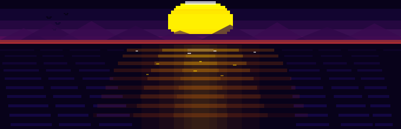

<!-- Header typing animation -->
<div align="center">
  
</div>

---

```shell
$ whoami
> Mark Maichenko — Versatile Software Developer (Generalist)

$ location
> Munich, Germany DE

$ profile
> 5 years of tech education & hands-on building.

$ looking_for
> Internship
> Ausbildung (Fachinformatiker AE)
> Part/Full-time Job

$ status
> Ready to bring 5 years of solid foundation to your team.

```

<div align="center">
  
</div>

---

**Tech Stack**

**Languages**


**Frameworks & Libraries**


**Databases**


**Tools & Cloud**


**Design**


**Game & Hardware**


---
                                                                                                                                    
<div align="center">
  
</div>                                                                                                                                              

---

<div align="center">
  
</div>


